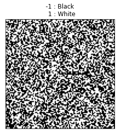

```python
import numpy
from matplotlib import pyplot as plt
import matplotlib.cm as cm


#격자크기를 받아 초기 이징모델 생성

class Ising2D:
    
    lattice_2D = [] #멤버변수
    L=0

    def __init__(self,L): #생성자  , 인스턴스 변수
        Ising2D.L = L
        Ising2D.lattice_2D = Ising2D.gen_spinArray(Ising2D.lattice_2D,L)

    def gen_spinArray(array,L): #배열과 격자크기(L)를 입력받으면 L*L사이즈 랜덤스핀배열 리턴
        array = numpy.random.random((L,L))
        array = numpy.where(array < 0.5,-1,array)
        array = numpy.where(array > 0.5,1,array)
        return array

    #이미지 그래프 생성 함수
    def show_lattice(void):    #입력받은 스핀배열 그래프 출력
        plt.imshow(Ising2D.lattice_2D)
        plt.imshow(Ising2D.lattice_2D, cmap = cm.gray)
        plt.title('-1 : Black\n  1 : White')
        ax = plt.gca()
        ax.axes.xaxis.set_visible(False)
        ax.axes.yaxis.set_visible(False)
        plt.show()
        
    def energy_calc(self,x,y): # x,y=전자의 위치, 에너지 계산 함수
        if y==(Ising2D.L-1): up=0
        else: up = y+1

        if y==0: down = (Ising2D.L-1)
        else: down = y-1

        if x==(Ising2D.L-1): right=0
        else: right = x+1

        if x==0: left = (Ising2D.L-1)
        else: left = x-1

        e = (-1) * Ising2D.lattice_2D[x][y] * \
                (Ising2D.lattice_2D[left][y] + \
                    Ising2D.lattice_2D[right][y] +\
                      Ising2D.lattice_2D[x][up] +\
                           Ising2D.lattice_2D[x][down])
        return e

lat = Ising2D(100)
lat.show_lattice()


```


    

    


```python

```


```python

```
