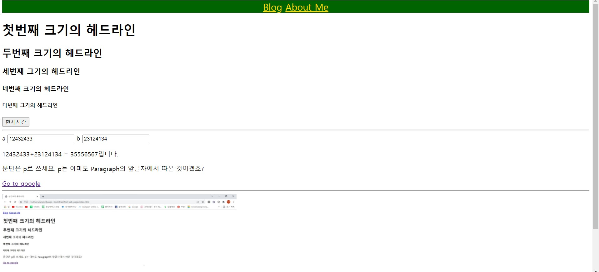

.

.

.

## CSS 살펴보기

.

###  CSS란?


css란 웹 문서의 디자인을 구현하기 위한 언어이다.

HTML이 웹페이지의 틀을 만들고 CSS가 텍스트의 크기, 색, 이미지의 크기, 위치 등을 지정해준다.

.

.

.

### CSS 적용하기

1. css 파일만들기

   새로 만든 css 파일에다가 기존의 HTML 파일에 있던 <style> 태그 내용을 그대로 옮긴다.
   
2. html에 css 링크 달기

   <.style>태그를 지우고
   
   <link *href*="./practice.css" *rel*="stylesheet" *type*="text/css" /> 를 추가한다.
   
   그러면 방금만 든 practice.css 를 사용한다는 의미가 된다.
   
   나머지 페이지에도 추가해준다.

	index 페이지의 헤드라인에 추가

    ```python
    <!DOCTYPE html>
    <html>
      <head>
        <link href="./practice.css" rel="stylesheet" type="text/css" />
        <title>손진효의 홈페이지</title>
      </head>
    ```

   

    about me페이지의 헤드라인에 추가
   
    ```python
    <!DOCTYPE html>
    <hrml>
      <head>
        <link href="./practice.css" rel="stylesheet" type="text/css" />
        <title>About Me</title>
      </head>
    ```

   
   
    Blog페이지의 헤드라인에 추가
   
    ```python
    <!DOCTYPE html>
    <hrml>
      <head>
        <link href="./practice.css" rel="stylesheet" type="text/css" />
        <title>Blog</title>
      </head>
    ```


이러한 방법으로 수십개의 페이지의 디자인을 변경할 수 있다.


## 자바스크립트 살펴보기


### 덧셈 기능이 있는 자바스크립트 추가하기

**자바스크립트 코드는 <script> 코드 안에 담으면 된다. 자바스크립트는 홈페이지에 뇌를 달아주는 듯한 느낌을 준다.


자바스크립트를 홈페이지에 링크해주기 위해서 새로운 .js파일을 만들어서 html에 링크해준다. 링크는 헤드라인에 해주면 된다.


```html
<!DOCTYPE html>
<html>
  <head>
    <title>손진효의 홈페이지</title>
    <link href="./practice.css" rel="stylesheet" type="text/css" />

      
	#이 부분이다#
    <script type="text/javascript" src="add_two_number.js"></script>
    <script type="text/javascript" src="what_time_is_it.js"></script>

  </head>

  <body>
    <nav>
      <a href="./index.html"></a>
      <a href="./blog_list.html">Blog</a>
      <a href="./about_me.html">About Me</a>
    </nav>

    <h1>첫번째 크기의 헤드라인</h1>
    <h2>두번째 크기의 헤드라인</h2>
    <h3>세번째 크기의 헤드라인</h3>
    <h4>네번째 크기의 헤드라인</h4>
    <h5>다번째 크기의 헤드라인</h5>

    <button onclick="whatTimeIsIt()">현재시간</button>
    <hr/>

    <label for="inputA">a</label>
    <input id="inputA" value="1" onkeyup="doSomething()">
    <label for="inputB">b</label>
    <input id="inputB" value="2" onkeyup="doSomething()">

    <p><span id="valueA">1</span>+<span id="valueB">2</span> = <span id = "valueC">3</span>입니다.</p>


    <p>문단은 p로 쓰세요. p는 아마도 Paragraph의 앞글자에서 따온 것이겠죠?</p>
    <a href="https://www.google.com">Go to google</a>
    <hr/<>
    </a>
  </body>
</html>

```

9,10 번쨰 줄에 보이듯이 소스부분에 이름을 붙여주면 된다.


덧셈 기능을  가진 자바스크립트 함수

```javascript
function doSomething() {
  let a = document.getElementById("inputA").value;
  let b = document.getElementById("inputB").value;
  document.getElementById("valueA").innerHTML = a;
  document.getElementById("valueB").innerHTML = b;
  document.getElementById("valueC").innerHTML = Number(a) + Number(b);
}

```

 

이 부분은 add_two_number.js 파일 안에 들어있는 함수이다.

 숫자 2개를 입력받아서 덧셈을 하는 함수이다.


숫자를 입력하면


전체적인 모습이다.




### 시간 알림 기능이 있는 버튼 추가하기


```javascript
function whatTimeIsIt() {
  alert(new Date());
}

```


이 함수는 현재 시간을 알림으로 알려주는 함수이다.  버튼을 추가하여 이 함수가 작동하도록 코드를 짜면


```html
<!DOCTYPE html>
<html>
  <head>
    <title>손진효의 홈페이지</title>
    <link href="./practice.css" rel="stylesheet" type="text/css" />

    <script type="text/javascript" src="add_two_number.js"></script>
    <script type="text/javascript" src="what_time_is_it.js"></script>

  </head>

  <body>
    <nav>
      <a href="./index.html"></a>
      <a href="./blog_list.html">Blog</a>
      <a href="./about_me.html">About Me</a>
    </nav>

    <h1>첫번째 크기의 헤드라인</h1>
    <h2>두번째 크기의 헤드라인</h2>
    <h3>세번째 크기의 헤드라인</h3>
    <h4>네번째 크기의 헤드라인</h4>
    <h5>다번째 크기의 헤드라인</h5>
	
      #이 부분이다.#
    <button onclick="whatTimeIsIt()">현재시간</button>
    <hr/>

    <label for="inputA">a</label>
    <input id="inputA" value="1" onkeyup="doSomething()">
    <label for="inputB">b</label>
    <input id="inputB" value="2" onkeyup="doSomething()">

    <p><span id="valueA">1</span>+<span id="valueB">2</span> = <span id = "valueC">3</span>입니다.</p>


    <p>문단은 p로 쓰세요. p는 아마도 Paragraph의 앞글자에서 따온 것이겠죠?</p>
    <a href="https://www.google.com">Go to google</a>
    <hr/<>
    </a>
  </body>
</html>

```


버튼이 클릭되면 함수가 실행되도록 짜게 되었고 버튼이 이름을 "현재시간으로 한 것이다."


화면에 보이는 현재시간 버튼을 클릭한 것이다.
