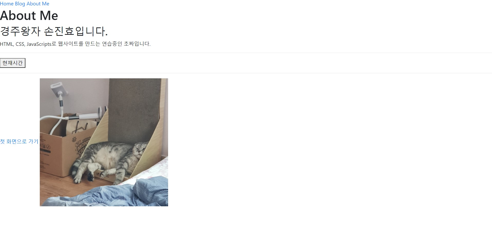

.

.

.

# 부트스트랩 사용하기


## 부트 스트랩 알아보기

html과 css 만으로 충분히 괜찮은 웹 페이지를 만들 수 있지만 마치 그림을 연필 한 자루로 그리는 것과 같다.

특히 최근엔 컴퓨터 화면 크기의 다양성, 태블릿, 스마트폰 등등 다양한 크기의 화면이 나와 있기 때문에 이를 충분히 고려해야 한다.

이 때문에 부트스트랩을 사용하는 것이다.


### 부트스트랩이란??

Bootstrap은 웹 개발에 있어 보편적으로 널리 쓰이는 구성 요소들을 미리 디자인 해둔 toolkit이다.

부트스트랩을 사용하면 웹 디자인에 대한 센스가 아직 부족한 개발자들도 그럴싸한 페이지를 만들 수 있다.

다양한 화면 크기에 대응할 수 있는 반응형 웹을 지향하기 때문에 크기에 따라 유연하게  변화할 수 있는  UX/UI 를 적용할 수 있다는 장점이 있다.


###### 부트스트랩의 css와 javascript 적용하기

1. 부트스트랩에서 css, css.map 파일 가져오기

   부트스트랩 공식 사이트 getbootstrap.com에 접속한 후 Download 버튼을 클릭하여 v4.5.x 버전으로 다운을 받는다.

   그 후 'Compiled CSS and JS' 아래의 <Download> 버튼을 클릭하여 설치 파일을 내려받는다.

   압축 파일 안에 css를 들어가  와 bootstrap.min.css.map 두 개의 파일을 index.html과 같은 경로에 압축을 푼다.

   압축을 푸는 폴더는 bootstrap4/css 로 정한다.

   그 후, 헤드 태그 안에 있는 practice.css 를 새로 받은 bootstrap4/css/bootstrap.min.css 로 연결한다.


```html
  <head>
    <title>손진효의 홈페이지</title>
      #이 부분이다.#
    <link href="./bootstrap4/css/bootstrap.min.css" rel="stylesheet" type="text/css" />

    <script type="text/javascript" src="add_two_number.js"></script>
```


지금 모양은 이상하지만.. 뭐 이쁘게 바뀌겠지..?


### 자바스크립트 코드 추가하기

자바스크립트 코드는 부트스트랩 웹사이트에서 직접 가져온다. 

홈페이지에서 조금 내리면 'jsDeliver' 항목이 나오니 그 곳에서 필요한 코드를 Copy를 통해 복사하면 된다.


```html
      <button onclick="whatTimeIsIt()">현재시간</button>
    <hr />

    <a href="index.html">첫 화면으로 가기</a>
    


	<script
      src="https://cdn.jsdelivr.net/npm/@popperjs/core@2.10.2/dist/umd/popper.min.js"
      integrity="sha384-7+zCNj/IqJ95wo16oMtfsKbZ9ccEh31eOz1HGyDuCQ6wgnyJNSYdrPa03rtR1zdB"
      crossorigin="anonymous"
    ></script>
    <script
      src="https://cdn.jsdelivr.net/npm/bootstrap@5.1.3/dist/js/bootstrap.min.js"
      integrity="sha384-QJHtvGhmr9XOIpI6YVutG+2QOK9T+ZnN4kzFN1RtK3zEFEIsxhlmWl5/YESvpZ13"
      crossorigin="anonymous"
    ></script>
```

 

About me.html <body>에 홈페이지의 jsDeliver 을 카피하여 넣은 코드 모습이다.

이제 페이지를 확인하면....!!





별거없다..

꾸민 것이 아니라 이제 부트스트랩 웹 사이트에서 코드를 바로 가져올 수 있도록 셋팅하였을 뿐이다. (바뀐거 없나 한참 찾아봤다..;)

이렇게 웹 사이트에서 코드를 바로 가져오는 방식을 **CDN(Contents Delivery Network)** 이라 한다.

물론 내려받은 압축 파일에서 bootstrap.min.js 파일을 이용할 수 있지만 이를 위해선 jQuery, popper.min.js 등도 필요하기 떄문에

지금은 CDN을 이용한 것이다.

쉽게 말해 CDN은 사람들이 자주 사용하는 css, js 파일 등을 모아놓은 곳이라고 생각하면 된다.


