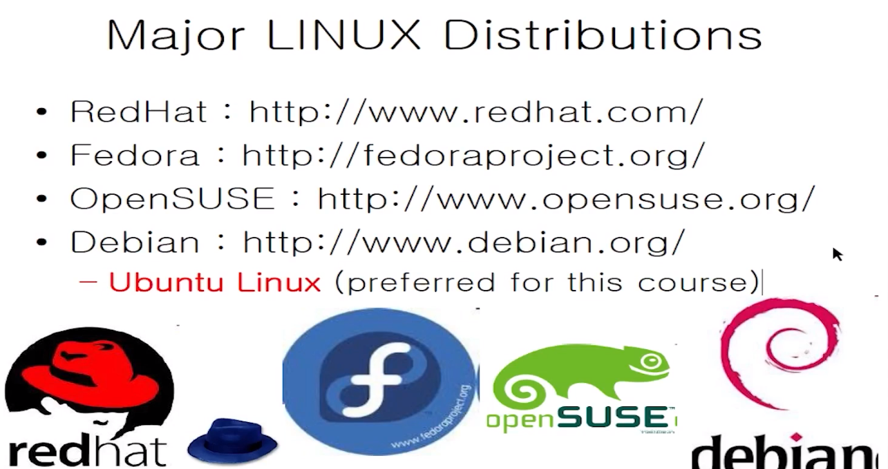

# 리눅스 시스템

## 리눅스 시스템의 소개

 

### 컴퓨터 시스템의 구조

컴퓨터 시스템을 객체화 하여 나타낸 구조이다.

우리가 흔히 쓰는 것이 어플리케이션 소프트웨어이고, 이를 구현해주는 장치가 하드웨어이다.

이를 연결해주는 것이 시스템 소프트웨어이고, 최대한 효율적이고 잘 활용할 수 있도록 해주는 것이다.

가장 대표적인 소프트웨어 시스템이 바로 **운영체제**이다

### Operating System(운영체제)

리눅스가 대체적인 기반이고 이전에는 **UNIX**가 있었다

#### UNIX란?

- UNIX is multi-user, multi-tasking operating system.

- UNIX kernel
  - The main component of operating system
  - Keep each process and user seperate
  - Regulate access to system hardware ( cpu, memory, disk, other .. )

​	

UNIX First version was created in Bell Labs in 1969. 

###### History of UNIX

- 1977 there were about 500 Unix sites world wide.

- 1980 BSD 4.1

- 1983 SunOS, BSD 4.2, System V

- 2988 AT&T and Sun Microsystems jointly develop System V Release 4 (SVR4). This later developed into UnocWare and Solaris 2.

- **1991 Linux was originated**

  

#### 리눅스란?

- 리눅스는 무료로 제공되는 유닉스 형태의 운영체제(유닉스 자체는 아님, 비슷한 형태)

- 리누스 토발즈의 프로젝트에서 출발 

- 리눅스는 GNU, GPL 을 기반으로 개발. 즉, 누구나에게 제공될 수 있다는 것

  ###### GNU 와 free software

  - GNU project

    - 마찬가지로 유닉스가 아니다.
    - 1989 GPL이 시작됨 (GNU general Public Lisence)

  - Free software

    - 무료로 제공되는 것 뿐만이 아니라 사용자들은 개발한 것을 무료로 배포해야 하는 의무가 있으며 누구나 자유로운 수정, 배포가 가능하다는 의미를 가짐

  - FLOSS ( Free/Libre Open Sourece Software)

    - End user alwats have the following freedoms

      

### Major LINUX Distirbutions

#### LINUX Distribution Timeline

### 리눅스의 사용 예시

1. 항공사의 항공시스템
2. 테슬라 계기판
3. 안드로이드 (리눅스 기반이지만 리눅스는 아님!)
4. 로보틱스 분야(효율적인 프로세스 관리)
5. 클라우드, 슈퍼컴퓨터 시스템

### Virtual machine

나의 기기는 리눅스로 이루어지지 않았지만 ( 윈도우, IOS 등 ) 리눅스를 테스트하기 위해 필요한  공간을 만들어주는 시뮬레이터

 